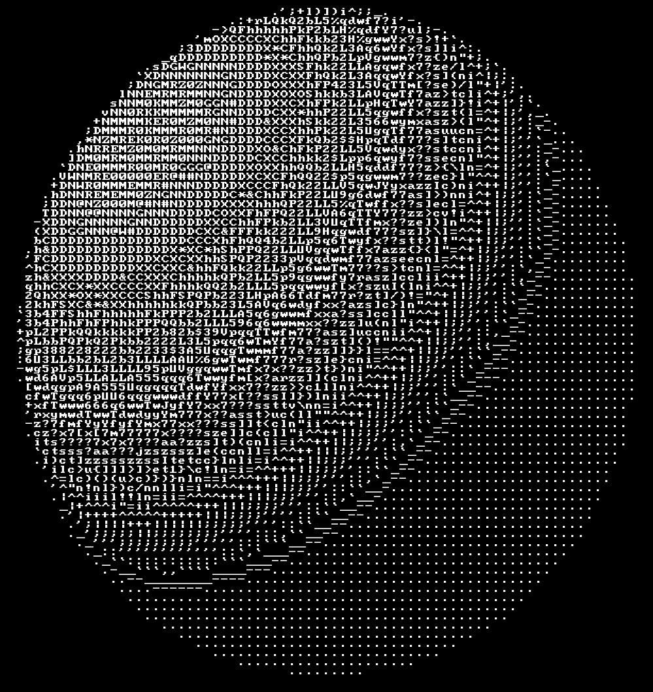

# ASCIIllusion (CgCourseProject)

Визуализатор трёхмерных моделей с использованием ASCII графики

Курсовая работа КГ МГТУ 5 сем

## Сборка

`make run/build [NAME=Имя сборки]`

Имя сборки - название папки и /cmd, по умолчанию main

`make run NAME=testing-mapping`

## Запуск

`./main.out -font-config=(.json файл настройки шрифта и терминала) -slice=(.txt или .json файл доступных символов ASCII) -font-file=(.ttf файл шрифта)`

Примеры файлов представлены в /fonts

## Команды

- **Команда загрузки:** `l ПУТЬ_К_ФАЙЛУ`
- **Команда удаления:** `rm ID`
- **Команда вращения:** `r ID УГОЛ ОСЬ(x/y/z)`
- **Команда перемещения:** `t ID tX tY tZ`
- **Команда масштабирования:** `s ID sX sY sZ`
- **Команда добавления источника света:** `ls X Y Z ЯРКОСТЬ`
- **Команда удаления источника света:** `rmls ID`
- **Команда перемещения камеры:** `mv РАССТОЯНИЕ`
- **Помощь:** `h`
- **Команда выхода:** `q`/`Ctrl+C`/`Esc`

## Пример работы

